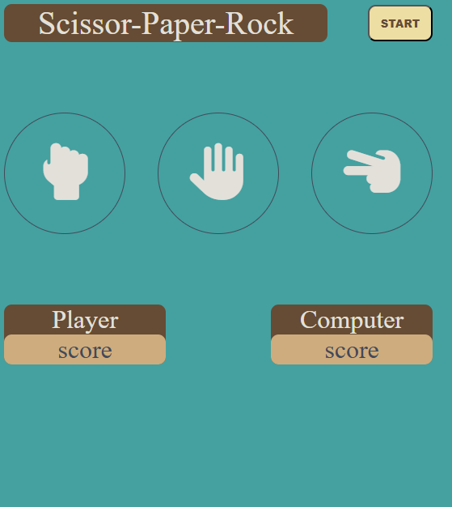

# ✊🖐✌️ Rock Paper Scissors Game

A fun and interactive **Rock Paper Scissors** game built with **HTML, CSS**, and **Vanilla JavaScript**. Challenge the computer, test your luck, and enjoy smooth gameplay in your browser!

---

## 🎮 Features

- 🤖 Play against a computer opponent with randomized choices  
- 🧠 Classic Rock-Paper-Scissors game logic  
- 📊 Real-time score tracking  
- 🎨 Clean, responsive, and user-friendly UI  
- 🔁 Replay as many rounds as you like  

---

## 🚀 Tech Stack

- **HTML** – Structure of the game elements  
- **CSS** – Styling and responsive design  
- **JavaScript (Vanilla)** – Game logic, DOM manipulation, and interactivity  

---

## 📸 Screenshots

  
*Add your actual game screenshot named `screenshot.png` in your repo root*

---

## 🧩 How to Play

1. Choose your move: ✊ Rock, 🖐 Paper, or ✌️ Scissors  
2. The computer will pick its move randomly  
3. The result will be displayed: Win, Lose, or Draw  
4. Scores are updated automatically  

---

## 🙌 Contributing

Contributions are welcome! If you'd like to enhance the UI, add sound effects, or animations, feel free to open a PR.

---

## ✍️ Author

Made with ❤️ by [Your Name](https://www.linkedin.com/in/prachi-dhunde-408b2825a)

